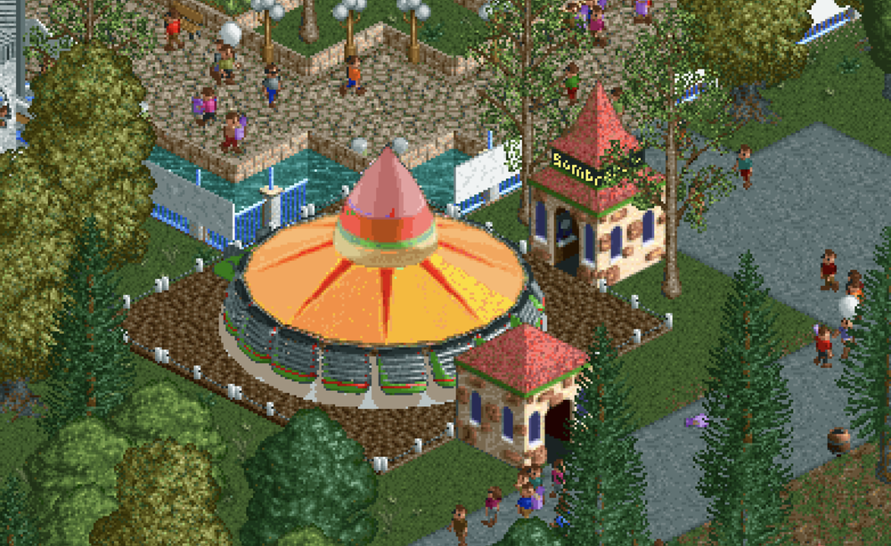

# El Sombrero 🌮

A custom ride for [OpenRCT2](https://openrct2.org). It's a spinning wheel with a
giant rotating sombrero on top. It started life as the game's Enterprise ride,
but it spins flat the way the real El Sombrero at Six Flags does, instead of
tilting all the way up to vertical.


There's a full quality clip in [`media/demo.mp4`](media/demo.mp4).

## Install

1. Grab `el_sombrero.parkobj` from this repo or the [Releases](../../releases) page.
2. Drop it into your OpenRCT2 object folder.
   - macOS `~/Library/Application Support/OpenRCT2/object`
   - Windows `%USERPROFILE%\Documents\OpenRCT2\object`
   - Linux `~/.config/OpenRCT2/object`
3. Start OpenRCT2 and look for El Sombrero in the Thrill Rides list.

## What's different from the stock Enterprise

- It spins flat with a gentle fan out instead of tilting up to vertical.
- The spin stays smooth at every speed, no jitter.
- It wears a big painted sombrero.
- It sits on a concrete pad, and the ride casts a shadow that sweeps across the
  pad as it spins.
- Riders don't poke through the hat.



## Building it yourself

The ride gets packed from the source PNGs by a Python script. You'll need Python 3
with Pillow and numpy, which you can grab with `pip install pillow numpy`, plus
OpenRCT2 installed (the script borrows its sprite build command). Then run it.

```bash
python3 build_parkobj.py
```

That converts the sprites to the game palette, packs `images.dat`, zips
everything into `el_sombrero.parkobj`, and drops a copy in your OpenRCT2 object
folder.

If you're not on a Mac, open `build_parkobj.py` and edit the two paths near the
top (the OpenRCT2 app and the object folder), since they're set up for macOS.

## How it works

Pretty much everything custom about this ride happens in `build_parkobj.py`. It
shuffles around which source PNG each sprite uses, so the actual art files,
`manifest.json`, and `object.json` stay untouched. If you want the full story on
the frame layout and the tuning knobs, it's written up in
[`CUSTOMIZATIONS.md`](CUSTOMIZATIONS.md).

## Credits

Made by TinkerSnail. The wheel and car art comes from RollerCoaster Tycoon 2's
Enterprise ride, and the sombrero is original. You'll need RollerCoaster Tycoon 2
assets through OpenRCT2 to play.
